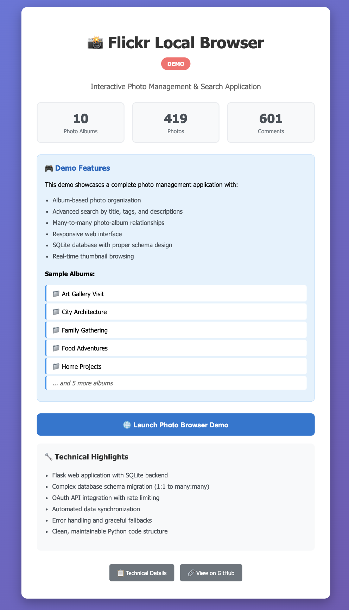

# 📸 Flickr Local Browser

A complete desktop application for downloading and browsing Flickr photo collections locally, with advanced search and album management capabilities.

> **Note**: This is a portfolio demonstration version of a custom application originally built for a private client. Personal data has been replaced with realistic demo content to showcase the technical implementation and user experience.

## 📷 Screenshots


_Demo launcher with statistics overview_


_Main photo browsing interface with album navigation_


_Photo detail view showing comprehensive metadata including titles, tags, descriptions, and EXIF data_

## 🧪 **Professional Testing Suite**

This project includes comprehensive testing demonstrating professional software engineering practices:

```bash
# Run the complete test suite
python run_tests.py
```

**Key Testing Features:**

- Database operations testing (many-to-many photo-album relationships)
- REST API endpoint validation
- Demo data generation quality assurance
- GitHub Actions CI/CD pipeline

[📖 View Testing Documentation →](tests/README.md)

## 🎯 Quick Demo

**Want to see it in action immediately?**

```bash
git clone https://github.com/your-username/flickr-local-browser
cd flickr-local-browser
python3 setup_portfolio_demo.py
python3 PORTFOLIO_LAUNCHER.py
```

The demo will automatically:

- Create 10 realistic photo albums
- Generate 400+ demo photos with rich metadata
- Set up a working photo browser interface
- Launch directly in your browser

## 🚀 Complete Setup Guide

### First Time Setup (Portfolio Demo)

1. **Clone & Navigate**

   ```bash
   git clone https://github.com/your-username/flickr-local-browser
   cd flickr-local-browser
   ```

2. **Setup Demo Environment**

   ```bash
   python3 setup_portfolio_demo.py
   ```

3. **Launch Application**
   ```bash
   python3 PORTFOLIO_LAUNCHER.py
   ```
   Browser opens automatically to `http://localhost:8080`

### For Live Flickr Integration (Optional)

For integration with actual Flickr account (requires API keys):

1. **Get Flickr API Credentials**

   - Visit [Flickr App Garden](https://www.flickr.com/services/apps/create/)
   - Create new app and get API Key + Secret

2. **Run Live Downloader**

   ```bash
   python3 START_FLICKR_BROWSER.py
   ```

3. **Setup OAuth Authentication**
   - Follow browser prompts for Flickr authorization
   - Credentials saved securely for future use

## 🏗️ Technical Architecture

**Backend (Python)**

- OAuth Authentication for private album access
- SQLite database with advanced many-to-many relationships
- Flask REST API with comprehensive endpoints
- Incremental update system for new photos

**Frontend (JavaScript/HTML/CSS)**

- Responsive photo grid interface
- Real-time search across titles/descriptions/tags
- Album filtering and navigation
- Modal photo detail views with metadata

**Key Technical Achievement: Database Design**

```sql
-- Advanced many-to-many photo-album relationships
CREATE TABLE photo_albums (
    photo_id TEXT,
    album_id TEXT,
    PRIMARY KEY (photo_id, album_id),
    FOREIGN KEY (photo_id) REFERENCES photos (id),
    FOREIGN KEY (album_id) REFERENCES albums (id)
);
```

This junction table design enables:

- Photos in multiple albums simultaneously
- Accurate album photo counts from relationships
- Efficient search across complex associations
- Perfect mirror of Flickr's actual data structure

## 🔍 Key Features

### Advanced Search & Filtering

- **Multi-field Search** - Across titles, descriptions, and tags simultaneously
- **Case-Insensitive Matching** - User-friendly search behavior
- **Album Filtering** - View photos from specific albums
- **Real-time Results** - Search results update immediately

### Database Management

- **Complex Relationship Modeling** - Many-to-many photo-album associations
- **Data Integrity** - Foreign key constraints and transaction safety
- **Query Optimization** - Efficient JOIN operations for photo retrieval
- **Incremental Updates** - Only downloads new photos on subsequent runs

### User Experience

- **Desktop Application** - No terminal commands needed for end users
- **Web-based Interface** - Familiar photo browsing experience
- **Offline Capability** - Browse complete collection without internet
- **Photo Metadata** - View titles, descriptions, tags, dates, view counts

## 🛠️ Development Workflow

### Project Structure

```
flickr-local-browser/
├── src/                     # Application source code
│   ├── server.py           # Flask REST API server
│   ├── oauth_downloader.py # Flickr API integration
│   └── launcher.py         # Web-based control interface
├── tests/                   # Comprehensive test suite
│   ├── test_database.py    # Database operations testing
│   ├── test_api_endpoints.py # REST API testing
│   └── test_demo_generator.py # Demo data testing
├── demo/                    # Demo data generation
├── data/                    # Photo storage and database
└── requirements.txt         # Python dependencies
```

### Development Commands

```bash
# Setup development environment
pip install -r requirements-dev.txt

# Run tests
python run_tests.py

# Run with test coverage
pytest tests/ --cov=src --cov-report=term-missing

# Launch development server
python src/server.py
```

## 📊 Project Achievements

This project demonstrates professional software development capabilities:

- **Database Architecture** - Complex many-to-many relationship design
- **API Development** - RESTful endpoints with proper error handling
- **User Interface** - Responsive, intuitive photo browsing experience
- **OAuth Integration** - Secure authentication with Flickr API
- **Testing Practices** - Comprehensive test coverage with CI/CD
- **Documentation** - Clear setup instructions and technical explanations

Originally developed as a custom solution for a private client's photo management needs, this portfolio version showcases the technical implementation with realistic demo data while protecting client privacy.

## 🎯 Technical Skills Demonstrated

- **Backend Development** (Python, Flask, SQLite, OAuth)
- **Frontend Development** (JavaScript, HTML/CSS, Responsive Design)
- **Database Design** (Junction tables, Query optimization, Data integrity)
- **API Integration** (Flickr API, REST endpoints, Error handling)
- **Testing & QA** (PyTest, Test automation, Code coverage)
- **DevOps** (CI/CD pipelines, Documentation, Deployment)

---

**Tech Stack**: Python, Flask, SQLite, JavaScript, HTML/CSS, PyTest, GitHub Actions
